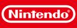

# Nintendo Quiz (Wii Homebrew)

A homebrew trivia quiz game for the Nintendo Wii (and Wii U in vWii mode) that challenges your Nintendo knowledge. Answer multiple-choice questions using your Wii Remote, earn points, and compete for highscores!



## Features

- **30 questions** covering classic Nintendo trivia
- **4 difficulty levels**: Easy, Medium, Hard, and Mixed
- **Timed questions**: 15 seconds per question
- **Highscore system**: Top 5 scores saved to SD card
- **Randomized questions**: Different order every game
- Played entirely with the Wii Remote (Wiimote)
- Use the `A`, `B`, `1`, and `2` buttons to pick an answer
- Press `HOME` to quit at any time

## Installation

### On a real console

1. Build the app (see [Building](#building)).
2. Copy the files to an SD card or USB drive:
   ```
   <drive>/
   └── apps/
       └── nintendo-quiz/
           ├── boot.dol
           ├── meta.xml
           └── icon.png
   ```
3. Launch it from the Homebrew Channel.

### Using the install script

A helper script (`main.py`) can copy everything to a homebrew drive automatically:

```
python3 main.py
```

It detects external drives with an `apps` folder, picks the `.dol` from the current directory, derives the target folder name from `meta.xml`, and copies `boot.dol`, `meta.xml`, and `icon.png` into place.

## Building

The project uses [devkitPPC](https://devkitpro.org/wiki/devkitPPC). First install devkitPro, then export the toolchain path and run:

```bash
export DEVKITPPC=/opt/devkitpro/devkitPPC
make
```

This produces `wii_hello.elf` and `wii_hello.dol`.

To load the app over USB Gecko / wiiload while a compatible loader is running:

```
make run
```

To clean up build artifacts:

```
make clean
```

## Project structure

```
├── source/          # C source code
│   └── main.c       # Game logic (video, Wiimote input, quiz loop, highscores)
├── Makefile         # devkitPPC build rules
├── main.py          # Helper script to install the app to a homebrew drive
├── meta.xml         # Homebrew Channel metadata
└── icon.png         # App icon
```

## Requirements

- devkitPPC toolchain
- A homebrew-capable Wii (or Wii U with vWii)
- One Wii Remote
- SD card (for highscore saving)

## License

This project is not affiliated with or endorsed by Nintendo. All Nintendo trademarks are property of their respective owners.
